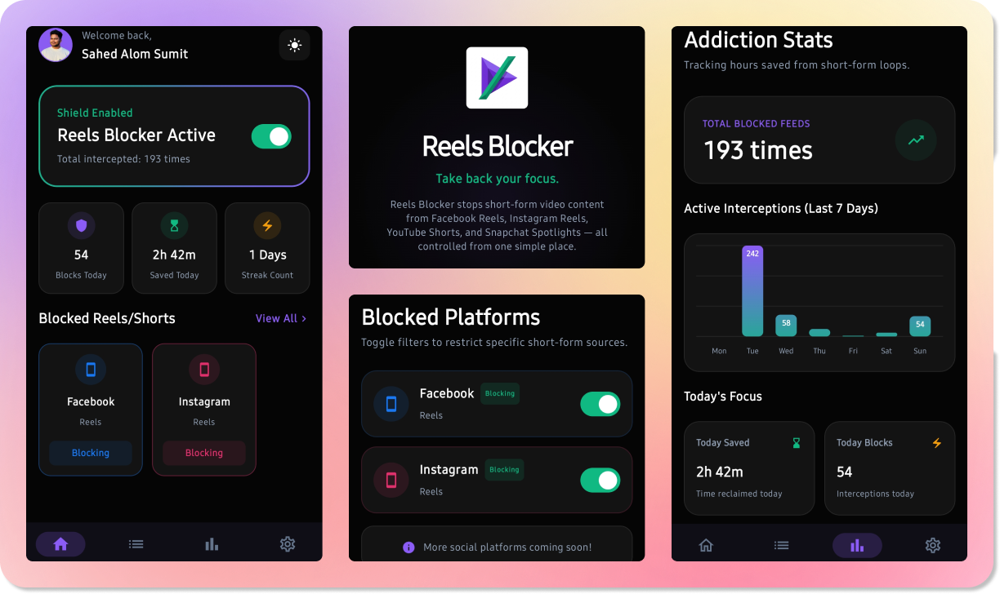

# 🛡️ Reels Blocker Web

  
   
  

 

Take back your time from endless doomscrolling. **Reels Blocker** is the ultimate privacy-first solution for stopping short-form videos on Instagram, YouTube, Facebook, and Snapchat.

> [!NOTE]
> This repository contains the web landing page and companion site for the Reels Blocker application.

---

## ✨ Key Features

- **🎯 Smart App & Keyword Matching**: Uses a high-performance tree traversal algorithm to detect Reels, Shorts, and Spotlight views instantly without sluggishness.
- **📱 Granular Blocking**: Granular, per-platform toggle options for Facebook, Instagram, YouTube, and Snapchat.
- **🕒 Smart Scheduler**: Set active hours where the blocker is enforced (e.g., bedtime block or work focus block).
- **📊 Real-time Stats**: View detailed charts of your blocked events and time saved.
- **🔄 Cloud Sync & Backup**: Syncs locally via Room and backs up to Cloud Firestore securely.
- **🔒 Privacy First**: Core blocking is 100% offline. Authentication is handled securely, and no browsing data is sent to the cloud.

---

## 🚀 Tech Stack

- **Structure**: Semantic HTML5
- **Styling**: [Tailwind CSS](https://tailwindcss.com/) for a modern, responsive interface.
- **Animations**: [GSAP](https://greensock.com/gsap/) for smooth, reveal-on-scroll transitions.
- **Interactivity**: Vanilla JavaScript for theme switching and UI logic.

---

## 🤝 Support the Mission

If you benefit from this project, consider giving **Sadaqah** to support maintenance and future development:

- **International**: [Donate via Stripe](https://donate.stripe.com/3cI8wO6bWcqd7F46az8AE01)
- **Bangladesh**: bKash Send Money to `01773615582` (Personal)

---

## ⚖️ License

Distributed under the MIT License. See `LICENSE` for more information.

---

Built with ❤️ by [Sahed Alom Sumit](https://sahedalomsumit.com)
